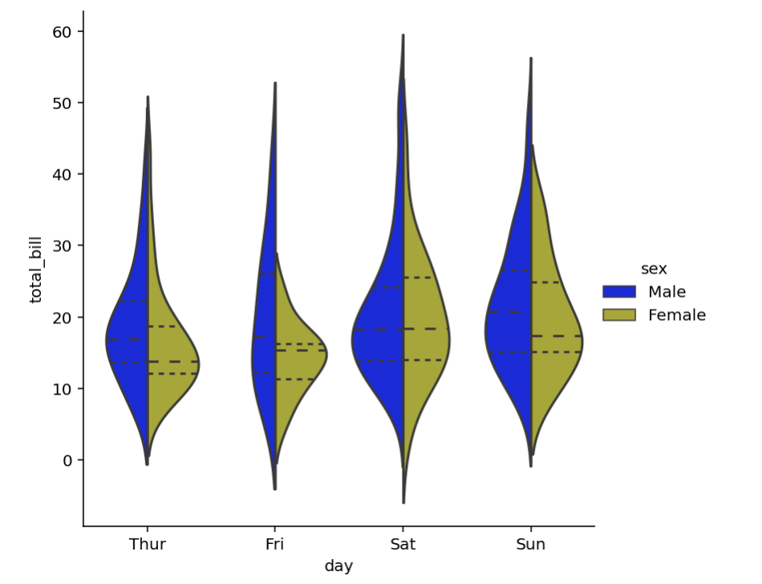

Here I will show you how to create a violin plot. 

A violin plot shows the distribution of quantitative data across several levels of one (or more) categorical variables such that those distributions can be compared. Unlike a box plot, in which all of the plot components correspond to actual datapoints, the violin plot features a kernel density estimation of the underlying distribution.

To create a violin plot, we must import the Seaborn library.


```python
import seaborn as sns
```

Seaborn is a library for making statistical graphics in Python. It builds on top of matplotlib and integrates closely with pandas data structures.

Now we'll load in a pre-made set of data from the github repository *seaborn-data*. It is called 'tips', and it contains information about the bills paid by the customers at a fictional restaurant.


```python
# Load the example tips dataset
tips = sns.load_dataset("tips")
```


```python
sns.catplot(x="day", y="total_bill", hue="sex", kind='violin', data=tips, split=True,
               inner="quartile", palette={"Male": "b", "Female": "y"})
```


    



The **sns.catplot()** function provides access to several axes-level functions that show the relationship between a numerical and one or more categorical variables using one of several visual representations. The kind parameter selects the underlying axes-level function to use. The **kind** that we select is (obviously) "violin" to generate a violin plot.

To make it easier to directly compare the distributions, we set **split to True** so that Python draws half of a violin for each level.

**Hue** is separated by **sex**, comparing total_bill by the sex of the tipper (i.e., male vs female). **Palette** allows us to add colours to each half of a violin, for better visualization.

**Inner = 'quartile'** determines the representation of the datapoints in the violin interior. Python draws the quartiles of the distribution.
